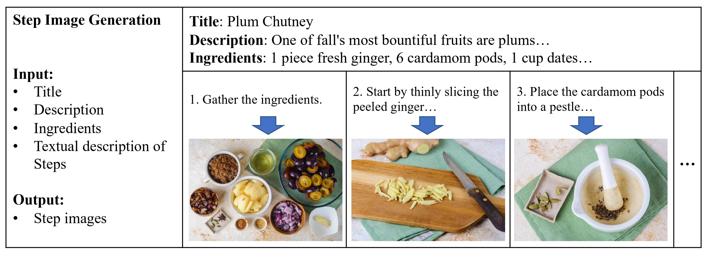
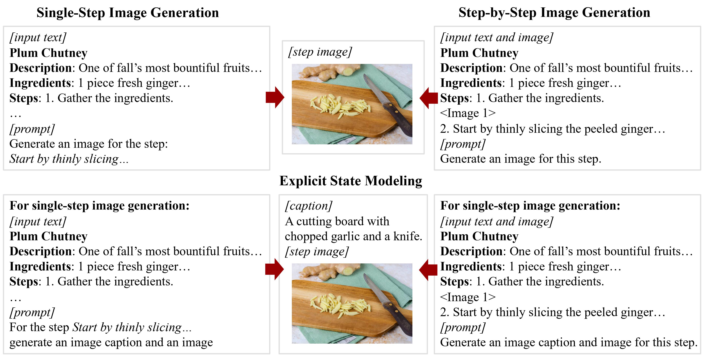
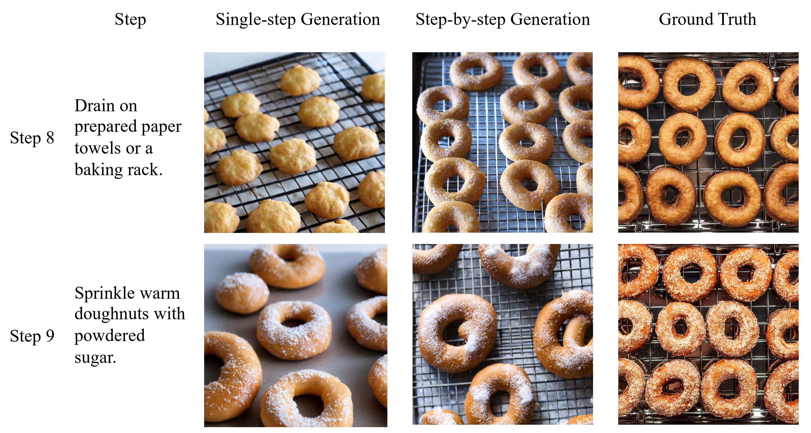
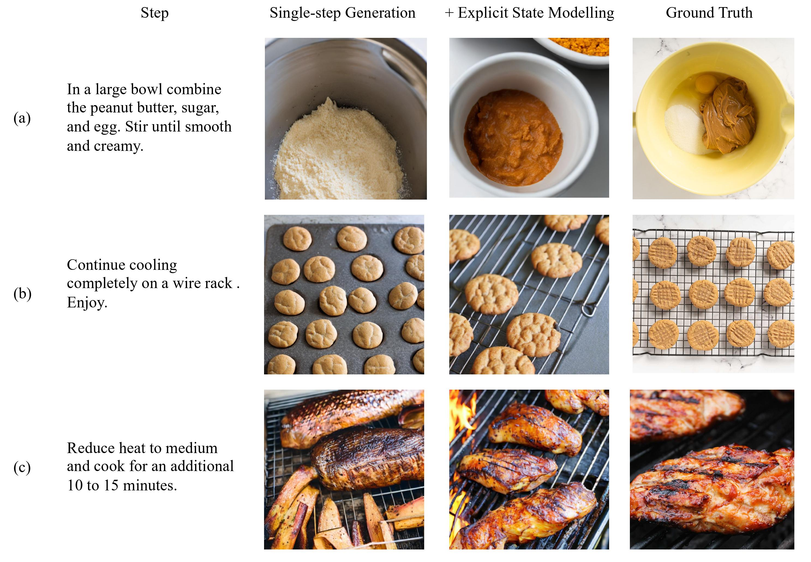
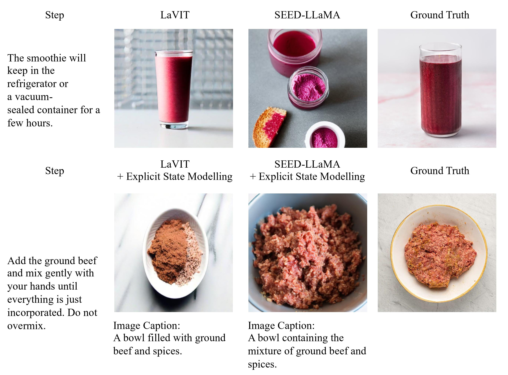

# Visualizing Entity States in Recipes by Generating Step Images

[Chengang Hu](https://aclanthology.org/people/c/chengang-hu/), [Yansong Feng](https://sites.google.com/site/ysfeng/home)

Wangxuan Institute of Computer Technology, Peking University

## Abstract

Procedural texts, such as recipes and instruction manuals, are crucial for understanding processes involving multiple entities over time. Entity state tracking, which monitors the states of specific entities at each time step, is a key task in this domain. However, existing benchmarks heavily rely on manually annotated datasets, limiting scalability. We propose a novel task of step image generation in recipes, using step images as visual supervision for tracking entity states in procedural text without relying on manually annotated data. By generating step images, we can visualize the entity states in each step. For this task, we collect high-quality multimodal recipe datasets, theSpruceEats. Addressing the limitation of existing two-stage methods in achieving deep interaction between text and image, this paper introduces an explicit state modeling approach based on multimodal generative models. Experiments on theSpruceEats dataset demonstrate that our method enhance entity state tracking and image generation quality compared to existing methods, improving the CLIP similarity metric by 10.2% compared to existing methods.

## Method

The following image illustrate proposed methods. On the top left, the single-step image generation method generates images based on the textual descriptions of a recipe and the corresponding steps. On the top right, the step-by-step image generation method incorporates previous steps and their images to produce the current step's image. At the bottom, the explicit state modeling approach enhances image generation by first generating an image caption which describes entity states before creating the final image.

## Cases

### Single-step v.s. Step-by-step

Step-by-step image generation method better retains information from earlier step images.

### Explicit Entity Modeling

The advantages of explicit entity modeling include: (a) correct entity states; (b) No missing entities; (c) High image quality.

### Comparison of Base Models

In the single-step method, LaVIT captures details better. However, with explicit entity modeling, SEED-LLaMA generates more accurate captions, resulting in better step images.

